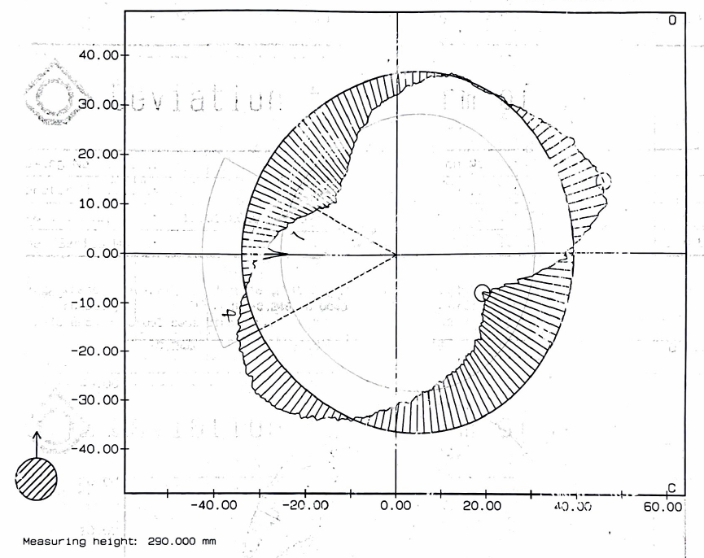
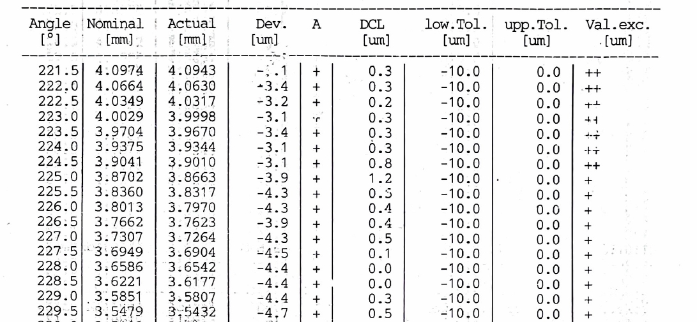
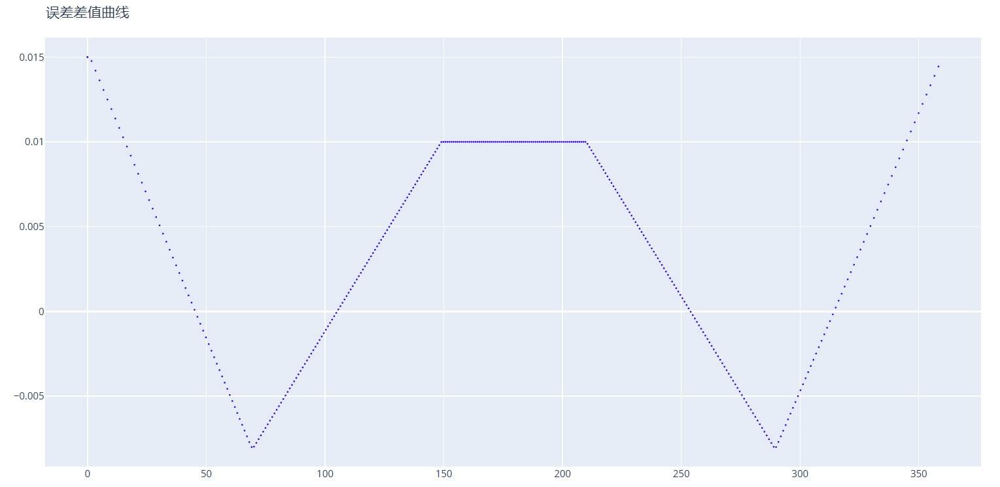

# CAM 误差叠加

主要用于将克林伯格 P65 测量仪或同类型设备的检测结果和标准凸轮数据进行极径方向的数据叠加，绘制实际加工出来的凸轮曲线。

P65 测量仪可以输出每个角度下相对于标准升程的误差值，需要根据这些测量数据制作出误差数据文件。

下面是一张的测量数据总图：


下面是部分角度下误差值：


根据这些误差数据，制作误差数据文件，格式如下：
```
A,0,70
0.015,-0.008

A,71,150
-0.008,0.01

A,151,210
0.01

A,211,290
0.01,-0.008

A,291,359
-0.008,0.015
```

`A` 关键词指定一个角度范围，例如：`71` 为起始角度，`150` 为结束角度，`-0.008` 为 起点角度处误差，`0.01` 为终点角度处误差。这个角度区间内误差自然过渡。

推荐每 10 度作为一个角度区间，可以保证误差数据准确还原的基础上不使得误差文件过大。

## 原始凸轮文件

输入一个标准的凸轮文件，用于作为误差数据的基础，从而制作出叠加误差的凸轮文件。测量仪使用的测量文件也需要基于此凸轮生成。

## 误差数据文件

输入根据测量数据制作的误差文件，根据上面提到的规则进行制作。

## 误差数据方向

定义误差数据中 `A` 标记的角度是以 X 轴正向坐标轴为基准轴沿顺时针方向还是逆时针方向定义。

需要根据测量仪实际测量方向以及误差数据方向来选择。

## 进刀尺寸调整

可以将误差数据整体叠加一个值，用于忽略实际加工多磨或少磨了少量尺寸情况下参数的误差。

例如：误差数据最大的地方是 -0.02，则说明整体尺寸可能磨小了，可以尝试将进刀尺寸调整参数设置为 0.02，这样可能更加方便观察误差变化。

## DXF 保存地址

输出实际测量出的凸轮曲线到文件。会同时输出误差曲线中定义的误差曲线图形。

---

以下图形是上面的示例误差数据生成的误差曲线：

