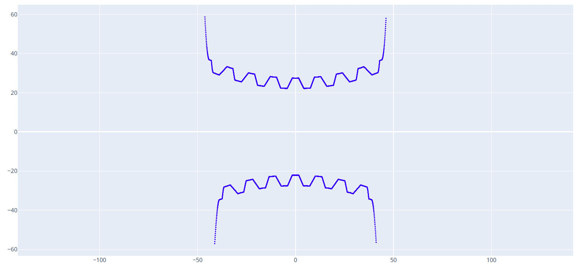

# 工件轴向截面计算

本功能模块用于计算和生成包络蜗杆在轴向平面上的理论截面轮廓。该轮廓是检验蜗杆齿形是否正确的关键依据，并可用于生成检验模板或进行加工仿真。

---

### 输入参数

以下参数是计算蜗杆轴向截面所必需的几何和工艺条件。

#### 1. 中心距 (Center Distance)

* **定义**: 蜗杆轴线与配对的蜗轮轴线之间的最短垂直距离。
* **单位**: 毫米 (mm)。
* **解释**: 这是决定蜗杆蜗轮副基本尺寸和安装位置的核心参数。
* **示例值**: `109.3`

#### 2. 蜗杆喉部直径 (Worm Throat Diameter)

* **定义**: 包络蜗杆的最小直径，位于其中间凹陷的“喉部”。
* **单位**: 毫米 (mm)。
* **解释**: 这是定义蜗杆基本形状和尺寸的关键参数。
* **示例值**: `37.0`

#### 3. 蜗轮齿数 (Worm Wheel Teeth Number)

* **定义**: 与该蜗杆配对啮合的蜗轮的齿数。
* **单位**: 整数。
* **解释**: 蜗轮齿数影响传动比和蜗杆齿形的包络形成过程。
* **示例值**: `60`

#### 4. 砂轮安装倾角 (Grinding Wheel Installation Tilt Angle)

* **定义**: 砂轮在机床上的安装倾斜角度。
* **单位**: 度 (°)。
* **解释**: 为了正确地磨削出包络蜗杆的特殊齿形（环面形状），砂轮需要以特定的角度倾斜安装。这个角度是保证成形精度的关键，错误的设置会导致齿形偏差。
* **示例值**: `7.0`

#### 5. 砂轮直径 (Grinding Wheel Diameter)

* **定义**: 用于磨削加工的砂轮的当前直径。
* **单位**: 毫米 (mm)。
* **解释**: 软件需要精确的砂轮直径来模拟其表面与工件的接触线，从而计算出正确的截面形状。
* **示例值**: `500.0`

#### 6. 砂轮分度圆齿顶高 (Grinding Wheel Indexing Circle Addendum)

* **定义**: 此参数定义了成形砂轮从其理论分度圆到齿顶（最外边缘）的径向高度。
* **解释**: 这是在“高级参数”中也出现过的参数，用于精确描述成形砂轮的几何轮廓。此数据需要和`绘图工具 - 梯形`工具中生成齿型时输入的齿顶高一致。
* **示例值**: `2.33`

#### 7. 蜗杆计算齿数 (Worm Calculation Teeth Number)

* **定义**: 模拟计算蜗杆的齿数。
* **单位**: 整数。
* **解释**: 蜗杆齿越靠两侧越容易产生误差，计算的齿数越多可以更好的对工件进行数据分析。但过多的计算齿数会导致计算时间变长。
* **示例值**: `7`。

#### 8. 齿型文件地址 (Tooth Profile File Address)

* **定义**: 输入一个定义了砂轮截面形状的DXF文件路径。
* **解释**: 此处引用的DXF文件（例如上一部分生成的`tixing-20.dxf`）定义了砂轮的轴向齿形。软件将使用这个齿形作为“刀具”，来计算它在工件上“切削”出的形状。

#### 9. 保存文件 (Save File)

* **定义**: 为计算后生成的工件轴向截面曲线指定保存路径和文件名。
* **解释**: 计算结果将作为一个新的DXF文件被保存在此路径下，可用于后续的分析或制图。

---

### 操作按钮

#### 1. 生成工件截面曲线 (Generate Workpiece Section Curve)

* **操作**: 这是一个执行计算并生成图形文件的按钮。
* **解释**: 当所有参数设置完毕后，点击此按钮，软件将：
    1.  读取“齿型文件地址”中的砂轮轮廓。
    2.  基于中心距、倾角等所有几何和工艺参数，模拟砂轮的磨削运动。
    3.  计算出在蜗杆轴向截面上形成的最终齿廓曲线。
    4.  将该曲线保存为DXF文件到“保存文件”指定的路径。
    5.  同时会输出蜗杆分度圆上的滚道曲线三维形态图形，用于辅助分析。



#### 2. 计算工件数据 (Calculate Workpiece Data)

* **操作**: 这是一个执行数据计算的按钮。
* **解释**: 点击此按钮可能不会生成DXF文件，而是会在显示一系列关于工件截面的关键几何数据，例如：
```
输入数据:
    a   蜗轮蜗杆中心距: 109.3000
    d1  蜗杆分度圆直径: 37.0000 (0.33a ~ 0.38a)
    z2  蜗轮齿数      : 60
    z1  蜗杆头数      : 1
计算数据:
    i   传动比              : 60.0 (z2 / z1)
    d2  蜗轮分度圆直径      : 181.6000 (2a - d1)
    mt  蜗轮端面模数        : 3.0267 (d2 / z2)
    ha  蜗杆齿顶高          : 2.1187 (0.7 * mt)
    hf  蜗杆齿根高          : 2.7240 (0.9 * mt)
    h   蜗杆全齿高          : 4.8427 (1.6 * mt)
    c   齿顶间隙            : 0.6053 (0.2 * mt)
    r   蜗杆喉部分度圆导程角: 4.6765 (atan(d2 / (i * d1)))
    t   齿距角              : 6.0000 (360 / z2)
    db  主基圆直径          : 54.6500 - 73.2310 (0.5a ~ 0.67a)
    α  蜗轮分度圆压力角    : 17.5138 - 23.7818 (asin(db / d2))
    pt  蜗轮分度圆齿距      : 9.5086 (pi * mt)
    s2  蜗轮分度圆齿厚      : 5.2297 (0.55 * pt)   |   4.7543 (0.50 * pt)
    s1  蜗杆分度圆齿厚      : 4.2788   |   4.7543  |   (pt - s2) (不考虑圆周齿侧间隙)
    sn2 蜗轮分度圆法向齿厚  : 5.2123   |   4.7384  |   (s2 * cos(r))
    sn1 蜗杆分度圆法向齿厚  : 4.2646   |   4.7384  |   (s1 * cos(r))
```
