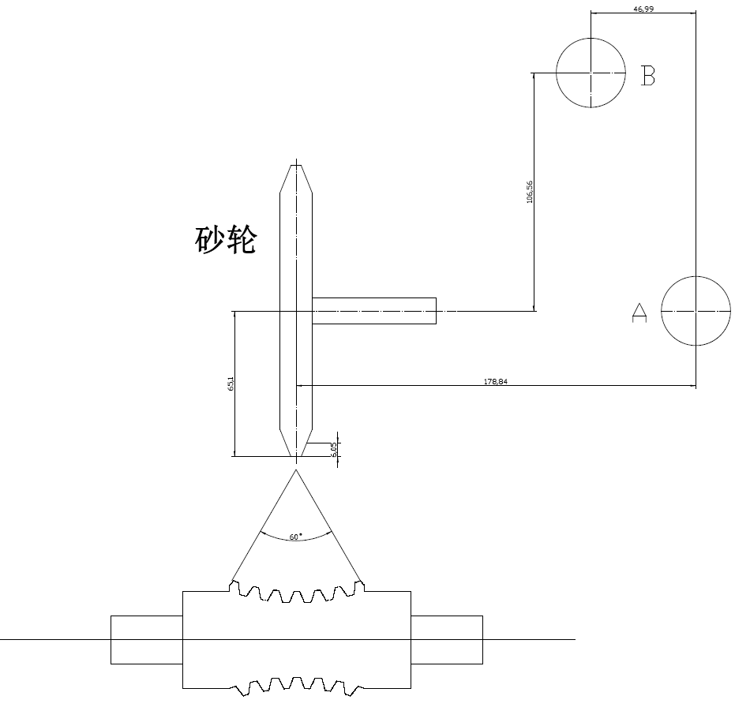

# 高级参数

本文档旨在解释“高级参数”选项卡中的各项参数。这些参数通常与CNC磨削中心的具体机床结构（运动学）和对刀设置相关，需要由熟悉机床操作的技术人员进行设置。错误的设置会导致严重的加工错误。

---

### 1. 砂轮分度圆齿顶高 (Grinding Wheel Indexing Circle Addendum)

* **定义**: 此参数指砂轮齿型从其理论分度圆到齿顶（最外边缘）的高度。数值必须和蜗轮分度圆齿顶高度保持一致，这是一个关键的几何尺寸。
* **解释**: 在复杂的成形磨削中，软件需要精确了解砂轮的轮廓尺寸以计算正确的接触点和避免干涉。此参数定义了砂轮工作轮廓的径向尺寸。
* **示例值**: `3.4`

### 2. B中心距砂轮中心.X (Distance from B-Center to Wheel Center in X)

* **定义**: 机床B轴回转中心到砂轮主轴中心在X坐标轴方向上的距离。
* **解释**: 这是一个描述机床几何结构的核心参数。B轴是控制砂轮摆动磨削的旋转轴。该参数精确定义了砂轮相对于B轴回转中心的位置，是进行四轴联动计算的基础。
* **示例值**: `606.23`

### 3. A中心距砂轮中心.Z (Distance from A-Center to Wheel Center in Z)

* **定义**: 机床A轴回转中心到砂轮主轴中心在Z坐标轴方向上的距离。
* **解释**: 与上一个参数类似，这描述了机床A轴回转轴中心与砂轮在Z方向上的相对位置。
* **示例值**: `75.1328`

### 4. B中心距A中心.Z (Distance from B-Center to A-Center in Z)

* **定义**: 机床B轴回转中心与A轴回转中心在Z坐标轴方向上的距离。
* **解释**: 这个参数定义了机床两个关键回转中心之间的相对位置，是机床运动学模型的核心数据之一，直接影响所有联动计算的准确性。
* **示例值**: `-1.145`

### 5. A0时砂轮距工件中心.Y (Wheel-to-Workpiece-Center Distance in Y at A=0)

* **定义**: 当A轴（指控制砂轮调整安装角的旋转轴）处于零度位置时，砂轮中心与工件回转中心在Y坐标轴方向上的偏移量。
* **解释**: 这是一个重要的安装和校准参数。理想情况下，该值可能为0，但实际装配中总会存在微小误差。精确测量并在此处输入该偏移值，可以对机床的几何误差进行补偿，确保Y方向的加工精度。
* **示例值**: `-0.0124`

### 6. 工件中点对刀基准.X (Workpiece Mid-Point Tool Setting Datum - X)

* **定义**: 在进行对刀操作时，将刀具（砂轮）移动到工件理论中点位置时，机床X轴的坐标值。
* **解释**: 这是设定工件坐标系（WCS）的基准值。操作员通过对刀仪或手动操作，找到工件的加工基准点，并将该点的机床坐标记录在此处。所有后续的加工路径都将基于此坐标原点进行计算。
* **示例值**: `0.0`

### 7. 工件中点对刀基准.Z (Workpiece Mid-Point Tool Setting Datum - Z)

* **定义**: 与上一条类似，这是工件中点对刀基准在机床Z轴的坐标值。
* **解释**: 定义了工件坐标系原点的Z向位置。
* **示例值**: `0.0`

### 8. 工件中点对刀基准.B (Workpiece Mid-Point Tool Setting Datum - B)

* **定义**: 与上同理，这是工件中点对刀基准的机床B轴（旋转轴）的角度值。
* **解释**: 定义了工件坐标系建立时B轴的旋转位置。
* **示例值**: `0.0`

### 9. 工件中点对刀基准.C (Workpiece Mid-Point Tool Setting Datum - C)

* **定义**: 与上同理，这是工件中点对刀基准的机床C轴（通常是工件主轴）的角度值。
* **解释**: 定义了工件坐标系建立时C轴的起始旋转位置，对于蜗杆加工尤其重要，因为它决定了螺旋线的起始相位。
* **示例值**: `350.0`

---
*注意: 每个参数右侧的绿色输入框是用于输入这些参数的测量补偿值或调整量。*