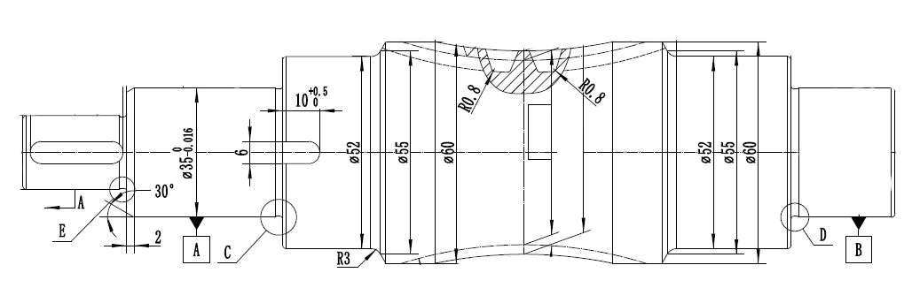
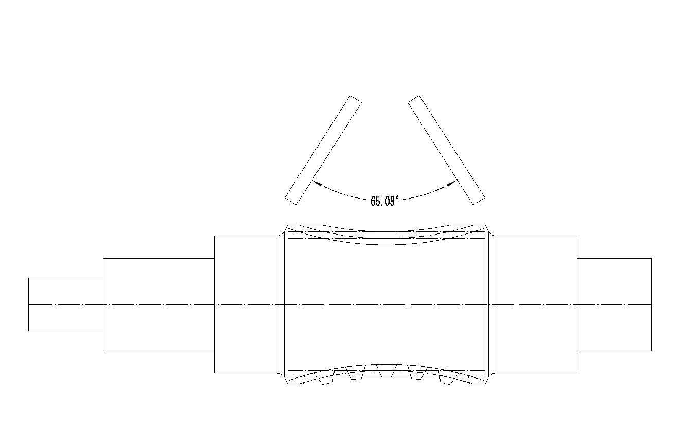

# 基本参数

基本参数界面主要涉及工件数据/砂轮数据/加工数据等。

---

### 1. 中心距 (Center Distance)

* **定义**: 指蜗杆轴线与蜗轮轴线之间的最短垂直距离。
* **单位**: 通常为毫米 (mm)。
* **解释**: 这是蜗杆蜗轮传动设计中最基本的参数之一，它决定了传动装置的整体尺寸。在此处输入的数值应与设计图纸上的中心距严格一致。
* **示例值**: `135.0`

### 2. 蜗杆喉部直径 (Worm Throat Diameter)

* **定义**: 包络蜗杆中间最细位置的直径，也称为蜗杆咽喉直径。
* **单位**: 毫米 (mm)。
* **解释**: 喉部直径是计算蜗杆其他几何尺寸（如齿高、齿宽等）的重要依据。该参数直接影响蜗杆的强度和与蜗轮的啮合性能。
* **示例值**: `49.9`

### 3. 蜗轮齿数 (Worm Wheel Teeth Number)

* **定义**: 与该蜗杆相啮合的蜗轮的牙齿数量。
* **单位**: 整数。
* **解释**: 蜗轮齿数与蜗杆头数（通常为1或2）共同决定了传动比。这个参数必须与配对的蜗轮设计参数完全一致。
* **示例值**: `60`

### 4. 蜗杆旋向 (Worm Rotation Direction)

* **定义**: 蜗杆螺旋线的旋转方向。
* **选项**: 右旋 (Right-hand) / 左旋 (Left-hand)。
* **解释**: 从蜗杆的轴线方向看，如果螺旋线顺时针远离观察者，则为右旋；反之则为左旋。蜗杆的旋向必须与配对的蜗轮旋向相匹配，以确保正确的传动方向。
* **示例值**: `右旋`

### 5. 蜗轮加工角度 (Worm Wheel Machining Angle)

* **定义**: 在生成加工程序时，用于计算刀具路径的一个关键角度，通常与蜗杆的长度和涡轮齿数相关。
* **单位**: 度 (°)。
* **解释**: 此参数指蜗杆和涡轮啮合部分的角度，也是砂轮实际在加工中摆动的角度范围。
* **示例值**: `65.0`

### 6. 砂轮安装倾角 (Grinding Wheel Installation Tilt Angle)

* **定义**: 砂轮在机床上的安装倾斜角度。
* **单位**: 度 (°)。
* **解释**: 为了正确地磨削出包络蜗杆的特殊齿形（环面形状），砂轮需要以特定的角度倾斜安装。这个角度是保证成形精度的关键，错误的设置会导致齿形偏差。
* **示例值**: `7.0`

> 此参数右侧为标准的`涡轮分度圆导程角`，部分工件按照设计可按照标准导程角加工蜗杆，打勾复选框可以自动将砂轮安装倾角赋值为标准导程角。

### 7. 磨削总深度 (Total Grinding Depth)

* **定义**: 从蜗杆毛坯表面开始，需要被磨削掉的总材料层厚度。
* **单位**: 毫米 (mm)。
* **解释**: 该值设定了总的加工余量。软件会根据这个深度和下面的“磨削步进”参数来计算总的加工层数。
* **示例值**: `1.0`

> 此参数右侧为磨削深度调整量，如果需要将工件多磨或少磨一定深度，且需要保持当前齿型啮合状态，可以设置此处调整量。

### 8. 磨削步进 (Grinding Step)

* **定义**: 每一次磨削循环（或每一刀）的切削深度。
* **单位**: 毫米 (mm)。
* **解释**: 这是指单次进刀的深度。较小的步进可以获得更好的表面光洁度和更高的加工精度，但会增加加工时间。该值通常分为粗磨和精磨阶段，精磨的步进值更小。
* **示例值**: `0.1`

### 9. 最大砂轮直径 (Maximum Grinding Wheel Diameter)

* **定义**: 加工过程中允许使用的砂轮的最大直径。
* **单位**: 毫米 (mm)。
* **解释**: 对应全新或刚修整过的砂轮直径。软件需要这个参数来精确计算砂轮表面点与工件的接触轨迹。
* **示例值**: `420.0`

### 10. 最小砂轮直径 (Minimum Grinding Wheel Diameter)

* **定义**: 砂轮因磨损和修整后，允许使用的最小直径。
* **单位**: 毫米 (mm)。
* **解释**: 当砂轮直径小于此值时，应更换砂轮。软件使用最大和最小直径范围来确保在整个砂轮寿命周期内，生成的刀具路径都是有效的，并可能用于补偿砂轮的磨损。
* **示例值**: `400.0`

### 11. 砂轮直径间隔 (Grinding Wheel Diameter Interval)

* **定义**: 在考虑砂轮从最大到最小直径的磨损过程中，用于计算和补偿的直径变化步长。
* **单位**: 毫米 (mm)。
* **解释**: 软件会根据这个间隔值，预先生成多组对应不同砂轮直径的补偿程序。例如，每当砂轮直径减小2.0mm，操作员就可以调用下一组程序，以保证加工精度。
* **示例值**: `2.0`

### 12. 磨削方向 (Grinding Direction)

* **定义**: 磨削加工时，砂轮相对于工件的轴向进给方向。
* **选项**: 从右往左 / 从左往右。
* **解释**: 这个选项决定了加工的起始位置和结束位置，决定了砂轮和工件的接触方式时顺磨还是逆磨。选择哪个方向通常取决于工件旋向，如果是左旋，推荐采用从左往右的方式，反之亦然。
* **示例值**: `从右往左`

### 13. 输出程序路径 (Output Program Path)

* **定义**: 用于保存生成的数控（NC）加工程序文件的文件夹位置。
* **解释**: 点击“选择路径”按钮，可以选择一个目标文件夹。软件完成计算后，会将包含所有刀具路径指令的程序文件夹保存到这个指定的路径下。
* **示例值**: `C:\Users\Downloads`
