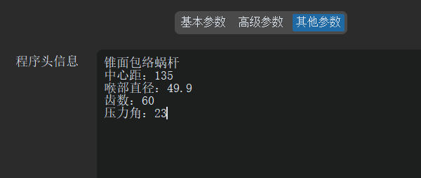

# 其他参数

一些附加信息设置。

## 程序头信息

在生成的加工代码文件中，用户可以在程序头部添加自定义信息，例如该程序所对应的工件信息，如工件参数、机床信息等，以便于后续的加工和管理。

示例如下：



实际加工代码中的效果如下：

```
;锥面包络蜗杆
;中心距：135
;喉部直径：49.9
;齿数：60
;压力角：23
;*****版本及日期*********
;软件版本:1.3.2
;生成日期:2025-07-21 15:09:35
;*****加工参数***********
;涡轮分度圆半径: 110.0500mm;
;涡轮加工角度:   50.0000度;
;涡轮齿数:       60齿;
...
```
